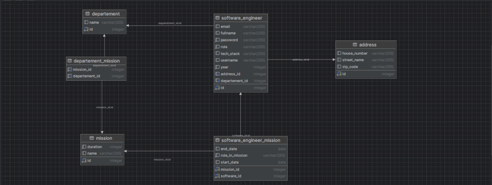
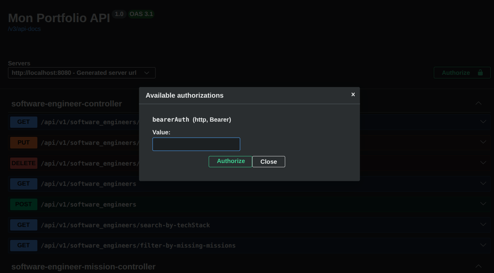
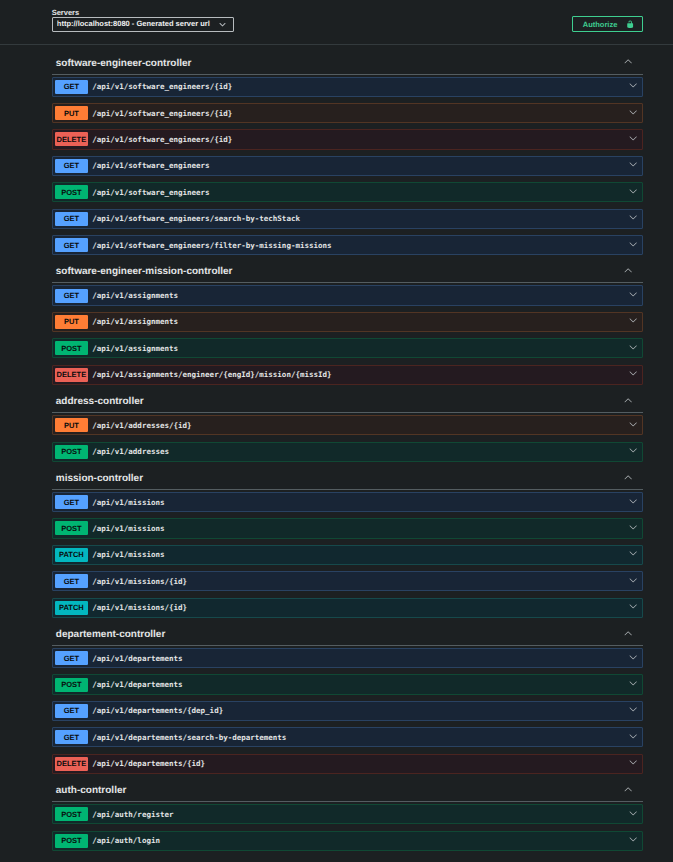

# Software Engineer Management API

## Présentation

**Software Engineer Management API** est une API REST développée avec **Spring Boot** dans le cadre d'un projet d'apprentissage approfondi du développement backend avec Java.

L'objectif principal de ce projet est de mettre en pratique, de manière progressive, les concepts fondamentaux et avancés de **Spring Boot**, depuis la création d'une API REST jusqu'à la gestion de la persistance des données, la validation des entrées et la sécurisation de l'application avec **JWT**.

Le projet permet notamment de gérer des **software engineers**, leurs départements, leurs missions et leurs adresses, tout en prenant en compte les relations entre les différentes entités.

---

##  Objectifs du projet

Ce projet a été réalisé principalement comme un **projet d'apprentissage pratique** afin de comprendre progressivement le fonctionnement d'une application backend moderne avec Spring Boot.

Les principaux objectifs étaient de :

* Comprendre la structure et le fonctionnement de **Spring Boot**.
* Concevoir une **API REST** avec différentes ressources.
* Manipuler les contrôleurs, services et repositories.
* Utiliser **Spring Data JPA** et **Hibernate** pour la persistance.
* Concevoir des relations entre les entités avec JPA.
* Mettre en œuvre des relations **One-to-One**, **One-to-Many** et **Many-to-Many**.
* Utiliser les DTO pour contrôler les données échangées avec l'API.
* Mettre en place la **validation des données**.
* Gérer les erreurs et les données invalides.
* Implémenter une authentification avec **JWT**.
* Mettre en place une **autorisation basée sur les rôles**.
* Utiliser **PostgreSQL** comme système de gestion de base de données.
* Conteneuriser la base de données avec **Docker et Docker Compose**.
* Documenter et tester l'API avec **Swagger / OpenAPI**.

---

## Technologies utilisées

| Technologie           | Utilisation                         |
| --------------------- | ----------------------------------- |
| **Java**              | Langage principal                   |
| **Spring Boot**       | Framework backend                   |
| **Spring Web**        | Création de l'API REST              |
| **Spring Data JPA**   | Accès aux données                   |
| **Hibernate**         | ORM                                 |
| **Spring Security**   | Sécurité de l'application           |
| **JWT**               | Authentification                    |
| **PostgreSQL**        | Base de données                     |
| **Docker**            | Conteneurisation                    |
| **Docker Compose**    | Gestion des services                |
| **Swagger / OpenAPI** | Documentation et test de l'API      |
| **Maven**             | Gestion des dépendances et du build |

---

##  Architecture des données

Le projet repose notamment sur les entités suivantes :

* `SoftwareEngineer`
* `Department`
* `Mission`
* `Address`
* `SoftwareEngineerMission`

Les relations entre ces entités permettent notamment de représenter :

* un software engineer appartenant à un département ;
* un software engineer possédant une adresse ;
* un département pouvant être associé à plusieurs missions ;
* plusieurs software engineers pouvant participer à plusieurs missions ;
* les informations complémentaires d'une affectation à une mission, comme le rôle, la date de début et la date de fin.

### Modèle de données

Le modèle relationnel de l'application est représenté ci-dessous :

<p align="center">
  
</p>

La table `software_engineer_mission` joue notamment le rôle d'entité d'association permettant de gérer la relation entre les software engineers et les missions tout en stockant des informations supplémentaires sur cette affectation.

---

##  Sécurité

La sécurité constitue une partie importante du projet.

L'application utilise **Spring Security** et **JWT (JSON Web Token)** pour gérer l'authentification et l'autorisation.

Le fonctionnement général est le suivant :

1. L'utilisateur accède à l'endpoint d'authentification.
2. Il fournit ses identifiants.
3. L'application vérifie les informations d'authentification.
4. Un token JWT est généré lorsque l'authentification est réussie.
5. Le token doit ensuite être utilisé pour accéder aux endpoints protégés.
6. Les rôles permettent de déterminer les opérations autorisées.

###  Administrateur

Dans la configuration actuelle du projet, les opérations de gestion sont réservées à **l'administrateur**.

L'administrateur peut notamment :

* créer des software engineers ;
* modifier les informations des software engineers ;
* supprimer des software engineers ;
* créer et gérer les départements ;
* créer et gérer les missions ;
* gérer les affectations entre les software engineers et les missions ;
* gérer les adresses ;
* effectuer les opérations protégées de l'API.

L'authentification est accessible via :

```http
POST /api/auth/login
```

Les opérations d'inscription et d'authentification sont séparées des ressources métier.

### Autorisation avec Swagger UI

Après une authentification réussie, le token JWT peut être utilisé directement dans **Swagger UI** grâce au bouton **Authorize 🔒**.

<p align="center">
  
</p>

Une fois le token renseigné, Swagger UI l'utilise pour effectuer les requêtes vers les endpoints protégés selon les autorisations de l'utilisateur.

---

## Validation des données

Une attention particulière a également été portée à la **validation des données reçues par l'API**.

L'objectif est d'empêcher l'application d'enregistrer des données incohérentes ou invalides.

La validation permet notamment de contrôler les informations envoyées par les utilisateurs avant leur traitement par l'application.

Cela permet d'améliorer :

* la fiabilité des données ;
* la sécurité de l'application ;
* la qualité des réponses de l'API ;
* la gestion des erreurs côté serveur.

---

## API REST

L'API expose plusieurs ressources.

### Software Engineers

```http
GET     /api/v1/software_engineers
GET     /api/v1/software_engineers/{id}
POST    /api/v1/software_engineers
PUT     /api/v1/software_engineers/{id}
DELETE  /api/v1/software_engineers/{id}
```

Des fonctionnalités supplémentaires permettent notamment de rechercher les software engineers par technologie et de filtrer ceux qui ne possèdent pas encore de mission.

### Missions

```http
GET     /api/v1/missions
GET     /api/v1/missions/{id}
POST    /api/v1/missions
PATCH   /api/v1/missions
PATCH   /api/v1/missions/{id}
```

### Départements

```http
GET     /api/v1/departements
GET     /api/v1/departements/{dep_id}
POST    /api/v1/departements
DELETE  /api/v1/departements/{id}
```

### Affectations

```http
GET     /api/v1/assignments
POST    /api/v1/assignments
PUT     /api/v1/assignments
DELETE  /api/v1/assignments/engineer/{engId}/mission/{misId}
```

### Adresses

```http
POST    /api/v1/addresses
PUT     /api/v1/addresses/{id}
```

### Authentification

```http
POST    /api/auth/register
POST    /api/auth/login
```

---

## Documentation avec Swagger / OpenAPI

L'API est documentée avec **OpenAPI** et accessible à travers **Swagger UI**.

Swagger UI permet de consulter les différents endpoints, leurs paramètres, les modèles de données ainsi que de tester directement les requêtes HTTP.

La documentation fournit notamment une vue d'ensemble des différents contrôleurs et des opérations disponibles dans l'API.

### Aperçu des endpoints

<p align="center">
  
</p>

Une fois l'application démarrée, la documentation Swagger est accessible depuis le navigateur à l'adresse configurée par l'application.

Après authentification, le bouton **Authorize 🔒** permet de fournir le token JWT afin de tester les endpoints protégés.

---

## Base de données

Le projet utilise **PostgreSQL** pour la persistance des données.

La structure de la base de données est gérée à travers **JPA/Hibernate**, avec des relations entre les différentes entités.

Le projet met notamment en pratique la gestion des relations entre entités et des tables d'association pour les relations plusieurs-à-plusieurs.

---

## Lancer le projet avec Docker

La base de données PostgreSQL est prévue pour fonctionner avec **Docker Compose**.

### 1. Cloner le projet

```bash
git clone <URL_DU_REPOSITORY>
cd <NOM_DU_PROJET>
```

### 2. Configurer les variables d'environnement

Créer le fichier `.env` à partir de la configuration attendue par le projet.

Les variables nécessaires concernent notamment les informations de connexion à PostgreSQL ainsi que les paramètres de sécurité de l'application.

>  Le fichier `.env` contenant des informations sensibles ne doit pas être ajouté au repository Git.

### 3. Démarrer PostgreSQL

```bash
docker compose up -d
```

Pour vérifier que le conteneur fonctionne :

```bash
docker ps
```

### 4. Lancer l'application Spring Boot

Depuis le projet :

```bash
./mvnw spring-boot:run
```

ou, si Maven est installé :

```bash
mvn spring-boot:run
```

L'application démarre ensuite sur le port configuré par Spring Boot.

---

## Utilisation de l'API

Une fois l'application démarrée, le parcours recommandé est le suivant :

### Étape 1 — Authentification

Commencer par l'endpoint :

```http
POST /api/auth/register
```
puis 
```http
POST /api/auth/login
```

Fournir les identifiants de l'administrateur.

### Étape 2 — Récupération du JWT

Lorsque les identifiants sont corrects, l'API retourne un token JWT.

### Étape 3 — Autorisation dans Swagger

Dans Swagger UI, cliquer sur :

```text
Authorize 
```

Puis entrer le token JWT obtenu lors de l'authentification.

### Étape 4 — Tester les endpoints protégés

Une fois le token enregistré dans Swagger, les requêtes autorisées peuvent être exécutées directement depuis l'interface.

L'autorisation dépend alors du rôle associé à l'utilisateur authentifié.

---

## Ce que ce projet m'a permis d'apprendre

Ce projet représente surtout une progression pratique dans l'apprentissage du développement backend avec Spring Boot.

J'ai pu passer progressivement de :

```text
Spring Boot
    ↓
API REST
    ↓
Architecture Controller / Service / Repository
    ↓
DTO
    ↓
JPA / Hibernate
    ↓
Relations entre entités
    ↓
Validation
    ↓
Gestion des erreurs
    ↓
PostgreSQL
    ↓
Spring Security
    ↓
JWT
    ↓
Autorisation par rôle
    ↓
Docker / Docker Compose
    ↓
Swagger / OpenAPI
```

L'objectif n'était donc pas uniquement de créer une API fonctionnelle, mais surtout de comprendre **comment construire progressivement une application backend structurée, persistante et sécurisée**.

---

## Améliorations possibles

Plusieurs évolutions pourraient être ajoutées dans de futures versions :

* Ajouter des tests unitaires et des tests d'intégration.
* Améliorer la gestion centralisée des exceptions.
* Ajouter une pagination plus complète.
* Ajouter une gestion plus fine des permissions.
* Ajouter un système de refresh token.
* Ajouter une interface frontend.
* Ajouter une CI/CD avec GitHub Actions.
* Améliorer la documentation OpenAPI.
* Ajouter une couverture de tests automatisés.

---

## À propos

Ce projet a été réalisé comme **projet personnel d'apprentissage de Spring Boot et du développement backend Java**.

Il constitue une étape pratique dans mon apprentissage de la conception d'API REST, de la persistance avec JPA/Hibernate et de la sécurisation des applications avec Spring Security et JWT.

---

## Licence

Ce projet est destiné principalement à l'apprentissage et à l'expérimentation technique.
